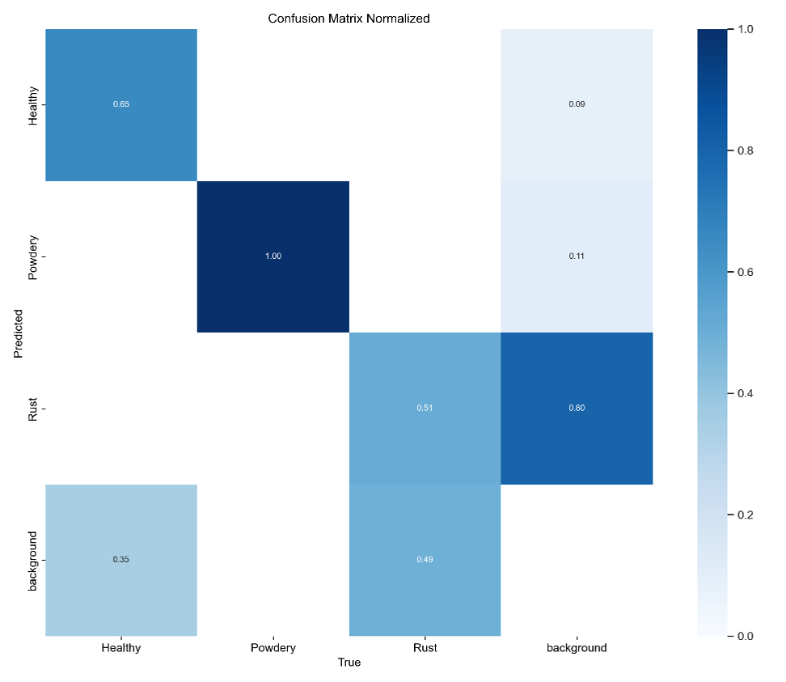
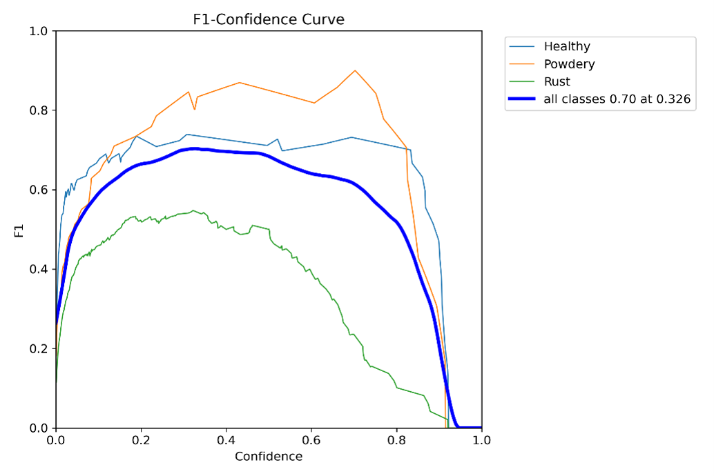
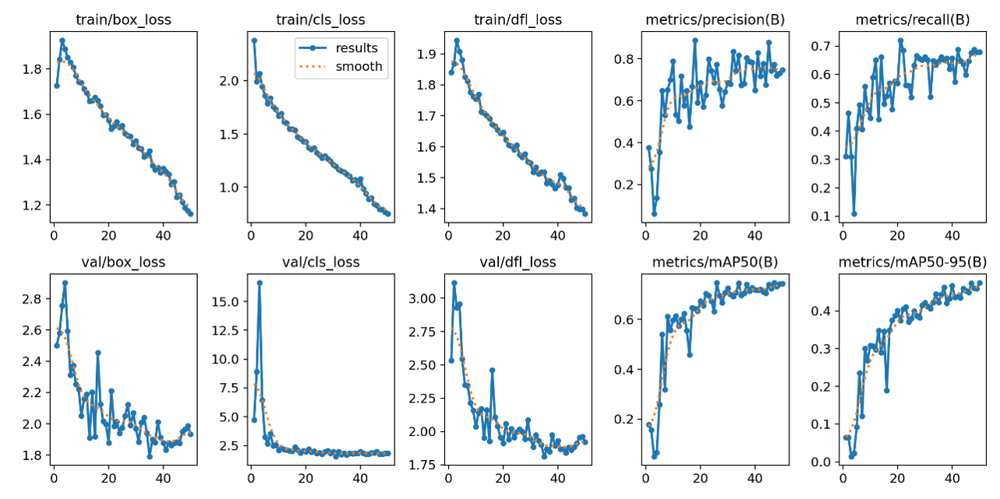
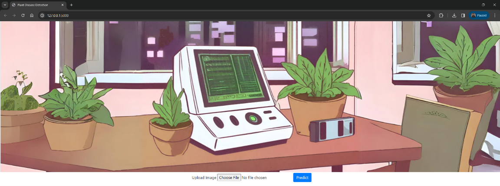
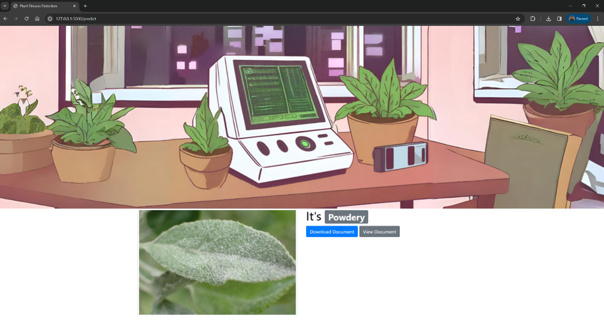
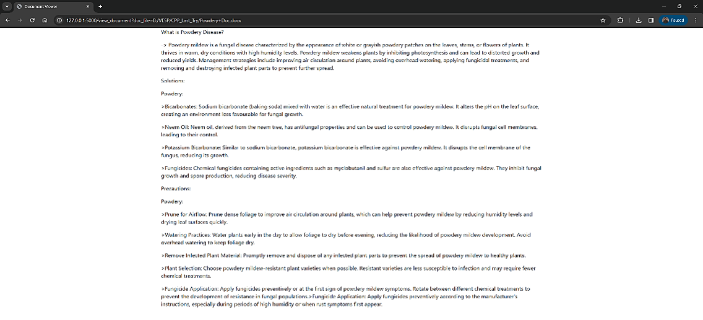
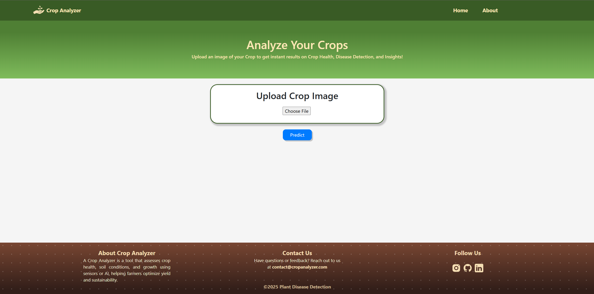
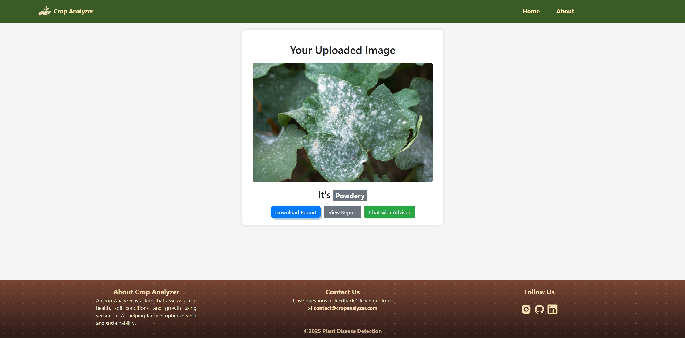
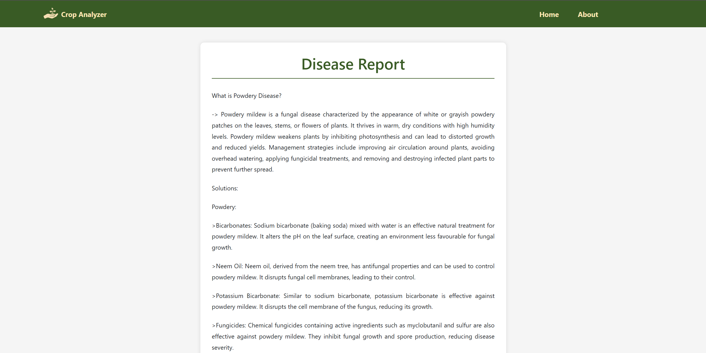
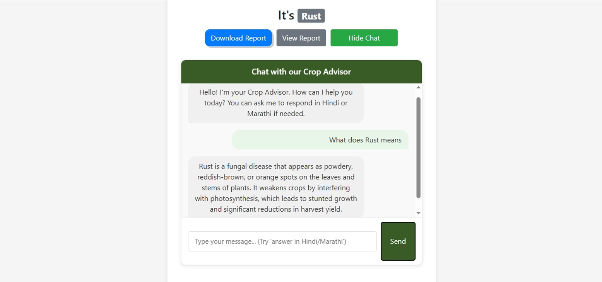

# Crop Disease Analyzer Using Deep Learning

<div align="center">
  
  
  
  
  
  
  
  
</div>

<br/>

> A deep learning-based plant disease detection system that identifies crop leaf diseases from images and provides detailed disease documentation — evolved from a diploma capstone project into a full-stack AI-powered web application.

**Diploma :** Vivekanand Education Society's Polytechnic (VESP), Chembur  
**Guide :** Bindu Ramesh

**B.E. Degree :** New Horizon Institute of Technology and Management (NHITM), Mumbai University

---

## Version History

| Version | Description | Status |
|---|---|---|
| v1.0 | CNN model + basic Flask prototype (Diploma Capstone) | ✅ Complete |
| v2.0 | Full UI redesign (CSS/JS) + Gemini AI Chatbot integration | ✅ Complete |

---

## About

Crop Disease Analyzer started as a diploma final year capstone project at VESP — a CNN-based Flask web application that could detect plant leaf diseases from uploaded images and display disease documentation.

In v2.0, the project was significantly upgraded during B.E. degree with a complete frontend redesign (CSS + JavaScript) and integration of a **Gemini AI-powered chatbot** for interactive disease guidance — making the system more accessible and user-friendly for real-world agricultural use.

The project was presented at **Ideathon, JSPM University, Pune** — where we learned that solving problems on a screen is very different from solving them at ground level, which shaped how the project evolved.

---

## What It Does

- Upload a leaf image → **CNN** model predicts the disease with confidence score
- If confidence ≥ 75% → displays disease name, documentation (symptoms, causes, treatment)
- If confidence < 75% → result marked as **Uncertain** (avoids false positives)
- (v2) **Gemini AI Chatbot** answers follow-up questions about the detected disease
- (v2) Redesigned UI with CSS + JavaScript for a better user experience

---

## Diseases Detected

### Rhamnus Davurica

| Disease | Confidence Threshold | Documentation |
|---|---|---|
| Healthy | ≥ 75% | `Healthy Doc.docx` |
| Powdery Mildew | ≥ 75% | `Powdery Doc.docx` |
| Rust | ≥ 75% | `Rust Doc.docx` |

> If the model confidence is below 75%, the result is reported as **Uncertain** to avoid incorrect diagnoses.

---

## Model Performance (v1 — CNN)

### Confusion Matrix (Normalized)


| Class | Score |
|---|---|
| Powdery Mildew | 1.00 |
| Healthy | 0.65 |
| Rust | 0.51 |
| Background | 0.0 |

### F1-Confidence Curve


- Overall F1 score: **0.70 at confidence threshold 0.326**
- Best performing class: Powdery Mildew (~0.88 peak F1)

### Training & Validation Metrics


- Training loss (box, cls, dfl) consistently decreasing across 50 epochs
- Precision reaching ~0.80, Recall ~0.65
- mAP@50 steadily improving throughout training

---

## Screenshots

### v1 — Original Prototype

#### Main Page


#### Prediction Result


#### Disease Documentation


---

### v2 — Redesigned UI + Gemini Chatbot

#### Main Page


#### Prediction Result


#### Disease Documentation


#### Gemini AI Chatbot


---

## Project Structure

```
Crop-Analyzer-AI-using-Deep-Learning
│
├── v1/                                   # Diploma Capstone Prototype
│   ├── model/
│   │   └── link for model.txt            # Trained model download reference
│   ├── screenshots/                      # Model performance & v1 UI screenshots
│   ├── static/
│   │   ├── images/                       # UI assets
│   │   └── user uploaded/                # User image uploads
│   ├── templates/
│   │   ├── index.html                    # Landing page
│   │   ├── Analysis.html                 # Upload / analyze page
│   │   ├── predict.html                  # Prediction results page
│   │   ├── feedback.html                 # Feedback form
│   │   └── view_document.html            # Disease documentation viewer
│   ├── Testing_DS/
│   │   └── link for testing dataset.txt  # Dataset download reference
│   ├── Flask_Doc_DV.py                   # Main Flask application
│   ├── Rhamnus_model2.ipynb              # Model training notebook
│   ├── Healthy Doc.docx                  # Healthy class documentation
│   ├── Powdery Doc.docx                  # Powdery Mildew documentation
│   └── Rust Doc.docx                     # Rust disease documentation
│
├── v2/                                   # Redesigned UI + Gemini Chatbot
│   ├── backend/
│   │   ├── app.py                        # Main Flask application
│   │   ├── check.py                      # Utility checks
│   │   ├── gemini_test.py                # Gemini API integration
│   │   ├── list_models.py                # Model listing utility
│   │   └── Path_helper.py                # Path utility helper
│   ├── environment/
│   │   ├── .env                          # API keys (not committed)
│   │   └── requirements.txt              # Python dependencies
│   ├── frontend/
│   │   └── static/
│   │       ├── css/                      # Stylesheets
│   │       ├── js/                       # JavaScript files
│   │       ├── docs/                     # Disease documentation files
│   │       ├── user_uploaded/            # User image uploads
│   │       └── templates/                # HTML templates
│   ├── model
│   │   └── link for model.txt            # Trained model download reference
│   ├── screenshots/                      # v2 UI screenshots
│   └── Testing_DS/
│       └── link for testing dataset.txt  # Dataset download reference
│
├── LICENSE
└── README.md
```

---

## Tech Stack

### v1
| Layer | Stack |
|---|---|
| **ML Framework** | TensorFlow / Keras (CNN) |
| **Backend** | Python, Flask |
| **Frontend** | HTML, CSS (Jinja2 templates) |
| **Model Format** | Keras H5 (`.h5`) |

### v2 (additions)
| Layer | Stack |
|---|---|
| **Frontend** | HTML, CSS, JavaScript |
| **AI Chatbot** | Google Gemini API |
| **Environment** | python-dotenv (.env) |

---

## Run Locally

### v1

#### 1. Navigate to v1
```bash
cd v1
```

#### 2. Download the model
Follow the link in `model/link for model.txt` and place `rahamnus.h5` inside the `model/` folder.

#### 3. Install dependencies
```bash
pip install flask tensorflow keras numpy pillow python-docx matplotlib seaborn scikit-learn
```

#### 4. Run
```bash
python Flask_Doc_DV.py
```
Open `http://127.0.0.1:5000`

---

### v2

#### 1. Navigate to v2
```bash
cd v2
```

#### 2. Set up environment
Create a `.env` file inside `environment/` and add your Gemini API key:
```
GEMINI_API_KEY=your_api_key_here
```

#### 3. Install dependencies
```bash
pip install -r environment/requirements.txt
```
#### 4. Download the model
Follow the link in `model/link for model.txt` and place `rahamnus.h5` inside the `model/` folder.

#### 5. Run
```bash
python backend/app.py
```
Open `http://127.0.0.1:5000`

---


## Model Training

- `v1/Rhamnus_model2.ipynb` — data preprocessing, augmentation, CNN architecture (Conv2D, MaxPooling, BatchNormalization, Dropout), Adam optimizer, training and evaluation

---

## Contributors

| Contributor | Role |
|---|---|
| Karan Bajrang Kale | ML Model, Flask Backend, Project Lead |
| Ishaan Nandoskar | UI/UX Design, Frontend (v2) |

---

## Origin

Built as the **final year capstone project** during Diploma in Automation & Robotics at VESP, Chembur. This project later served as the foundation for a published research paper presented at multiple Technical Paper Presentation (TPP) competitions including **Ideathon at JSPM University, Pune**.

The project continues to evolve — later versions incorporate IoT sensor integration, Data Warehousing, and role-based access for farmers and Gram Panchayat operators.